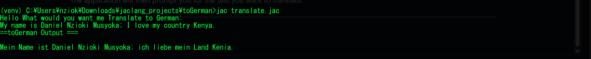

# 🌍 JacLang German Translator (Gemini API)

This is a simple **JacLang project** that uses Google Gemini via `byllm` to translate English text into **German** directly from the terminal.

---

### 🚀 Features

-   Prompts user for text input in the terminal.
-   Translates text to German using the Gemini LLM.
-   Provides a clean and interactive CLI experience.

---

### 📂 Project Structure

-   **`translate.jac`**: The main program file containing the `walker` and LLM definition.
-   **`translate.impl.jac`**: The implementation file that handles user input and prints the output.
-   **`README.md`**: This documentation file.

---

### 🛠️ Getting Started

#### Prerequisites

-   JacLang Runtime.
-   Google Gemini API Key.

#### Usage

1.  Set your Gemini API key as an environment variable:
    ```bash
    export GOOGLE_API_KEY="your_api_key_here"
    ```
    (Use `set` instead of `export` on Windows)

2.  Run the project from your terminal:
    ```bash
    jac run translate.jac
    ```

The application will then prompt you for the text you want to translate.

---

### 🖥️ Example Output


